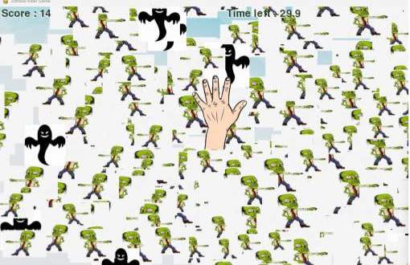

# ZOMBIE-KILLER GAME

Developed using Python programming language and the Pygame library, the project showcases advanced capabilities in real-time hand tracking and gesture recognition, enabling players to interact with animated characters on-screen through intuitive hand movements captured by a camera.

### Tools Used:
- Python
- Pygame
- OpenCV

